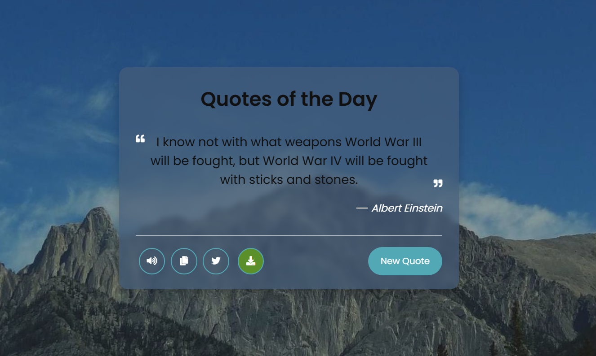

**Random Quote Generator**  

A Random Quote Generator website that displays a new motivational or inspirational quote every time you click the **"New Quote"** button.  

<h5 style="text-align: center;">Random Quote Generator Preview</h5>

### 1. What is used in this project?  

- **HTML**: It creates the structure of the webpage (buttons, text, icons, etc.).  
- **CSS**: It makes the page look beautiful (colors, fonts, alignment, etc.).  
- **JavaScript**: It makes the page interactive (fetching quotes, changing background images, copying text, exporting images, etc.).  

### 2. How does it work?  

- **New Quote Button**: Clicking this button fetches a new random quote and also changes the background image.  
- **Text to Speech**: Clicking the speaker icon reads the quote aloud.  
- **Copy to Clipboard**: Clicking the copy icon saves the quote to the clipboard for easy pasting.  
- **Twitter Share**: Clicking the Twitter icon lets you share the quote on Twitter.  
- **Export as Image**: Clicking the download icon converts the quote into an image and saves it.  
